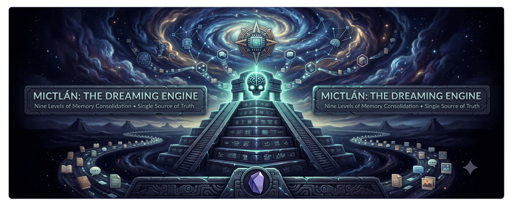

# Mictlán



> *Mictlán* — the Aztec land of the dead, reached by a nine-level journey. Here,
> the nightly journey each day's memories make to reach their durable rest.

The centralized **dreaming engine** — nightly memory consolidation for the whole
agent ecosystem. One engine, many thin per-agent adapters, one Obsidian Vault
(SSOT) served read-only by [`brain-mcp`](https://github.com/Skalas/brain-mcp).

Before `mictlan`, the dreaming code was scattered across the vault
(`_system/scripts/`), claude config (`~/.claude/commands/dream.md`), the Mac Mini
(Hermes `dream_cycle.py`), and an OpenClaw bundle — three agents drifting apart,
with the shared policy enforced by hand. `mictlan` is the one home. See
[`docs/adr/0001`](docs/adr/0001-centralize-dreaming-mictlan.md).

## The flow

```
many source-specific dreamers   →   common proposal schema   →   one semantic-dedup
(Claude Code · Hermes · Nico)        (mictlan.schema)            + human-approval gate   →   graph write
   fan-in of PROPOSALS, not of PROCESSING                          (node creation, with you)
```

- **Appends** to an existing note are the only auto-applyable output (durable,
  non-guardrailed, signed).
- **New nodes / links** are always **propose-only** → reconciled by the
  resolution gate → approved by a human once. Mictlán never auto-builds the graph.

## Architecture: engine vs adapter (à la `metate`)

```
mictlan/                 the engine — generic, installed once
├─ policy.py               load + sign the coexistence policy (fail-closed)
├─ ledger.py               sharded dedup ledger (per-host, union reads)
├─ schema.py        ★NEW   the common proposal envelope every dreamer emits
├─ proposals.py     ★NEW   semantic entity-resolution + approval-gate backlog
├─ triage.py              durable / ephemeral / uncertain
├─ analyzer.py            digest prompt branching on session mode
├─ orchestrate.py        prepare / apply proposals
├─ lint.py               proposal lint (wikilink resolvability, dating)
├─ pending.py            aggregate still-pending proposals across journals
├─ reindex.py            regenerate MOCs + sync frontmatter links:
├─ validate.py           schema conformance
└─ stagers/              one per source (claude_code, claude_web, cursor, …)

adapters/                  thin per-agent: discover + parse → emit DreamProposal
├─ claude_code/           (uses skills/dream)
├─ hermes/                dream_cycle.py  (Telegram + finance, Mac Mini)
└─ openclaw/              Nico shim/config (compiled bundle — config only)

skills/dream/              the Claude Code /dream skill (installed to ~/.claude)
docs/adr/                  decision records
tests/
```

**One model across all dreamers:** `gemini-3.5-flash`. OpenClaw may fall back to
other models *only on failure*; Hermes and Claude Code use it exclusively.

## Governance stays in the vault

`mictlan` is engine code; the *rules* remain single files in the vault, served
by brain-MCP and read at every run:

- `dream-policy.md` — coexistence rules (attribution, guardrails, ingest
  boundaries, propose-only). Loaded via `mictlan.policy` (fail-closed).
- `_system/CLAUDE.md` — vault write conventions (doctrine).
- `architecture.md` — the topology map.

Edit the file, bump its version → every agent inherits it on its next run.

## Installation

Prereqs: [`uv`](https://docs.astral.sh/uv/) and `git`. Set `MICTLAN_VAULT` if your
vault isn't at `~/Documents/Obsidian Vault`.

### One line (humans)

```bash
git clone git@github.com:Skalas/mictlan.git ~/github/skalas/mictlan && ~/github/skalas/mictlan/install.sh
```

Installs the engine (`uv sync`) and links the `/dream` skill into Claude Code. Then type `/dream`.

### Per agent harness

Each harness installs the same engine; only the entry point differs.

**Claude Code** (laptop) — engine + the `/dream` skill:

```bash
cd ~/github/skalas/mictlan && make install
```

Symlinks `~/.claude/commands/dream.md` → the repo (repo stays the source of truth). The skill's steps call the engine as `uv run --project ~/github/skalas/mictlan python -m mictlan.*`.

**Hermes** (Mac Mini) — its `dream_cycle.py` imports `mictlan`, so the package must be installed on the mini:

```bash
# on the Mac Mini, first time:
git clone git@github.com:Skalas/mictlan.git ~/github/skalas/mictlan
cd ~/github/skalas/mictlan && make install-hermes
```

Runs `uv sync` and symlinks `~/.hermes/scripts/dream_cycle.py` → the repo adapter. The nightly runner must invoke it through the project env:

```bash
uv run --project ~/github/skalas/mictlan python ~/.hermes/scripts/dream_cycle.py [YYYY-MM-DD]
```

**OpenClaw / Nico** (Mac Mini) — dreaming is a compiled bundle, so there is **no package to install**; mictlan owns only the config:

```bash
cd ~/github/skalas/mictlan && make install-openclaw   # prints the config to verify
```

Ensure `~/.openclaw/openclaw.json` has `model.primary = google/gemini-3.5-flash` and no dreaming-specific model override (fallbacks apply only on failure).

### Updating the mini from the laptop

```bash
make deploy-mini      # ssh the mini → git pull → make install-hermes
make test             # uv run --extra dev pytest
```

## Status

v0.1 — scaffolded by copy-first migration (engine copied in; nothing deleted from
old homes yet). Cutover (removing old copies, redeploying the mini) and the graph
reprocess are gated follow-ups — see the ADR.
